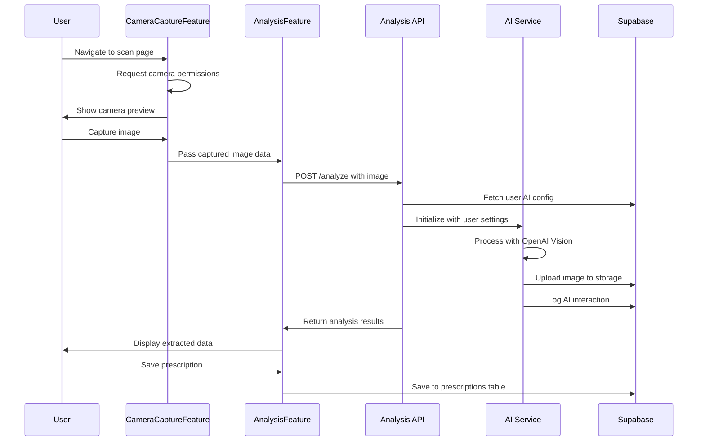

# Prescription Scanning - Technical Architecture

**Date**: 2025-08-30  
**Implementation**: Modern component-based architecture with AI integration

---

## 🏗️ **COMPONENT ARCHITECTURE**

### **Main Orchestration**
```typescript
// app/patient/presc/scan/page.tsx (Pure Client-Side)
type ScanStep = 'camera' | 'analyzing' | 'results' | 'error'

export default function PrescriptionScanPage() {
  // State management for multi-step workflow
  const [currentStep, setCurrentStep] = useState<ScanStep>('camera')
  const [capturedImage, setCapturedImage] = useState<string | null>(null)
  const [analysisResult, setAnalysisResult] = useState<any>(null)
  
  // Component orchestration based on current step
  switch (currentStep) {
    case 'camera': return <CameraCaptureFeature />
    case 'analyzing': return <PrescriptionAnalysisFeature />
    case 'results': return <PrescriptionResultsFeature />
    case 'error': return <ErrorDisplay />
  }
}
```

### **Component Separation by Responsibility**

#### **1. CameraCaptureFeature.tsx**
**Responsibility**: Camera hardware interaction only
- Camera permissions and getUserMedia API
- Video stream management (front/back switching)
- Image capture to canvas with quality controls
- Flash/torch control for better document scanning
- Error handling for camera failures

#### **2. PrescriptionAnalysisFeature.tsx**  
**Responsibility**: AI processing coordination only
- API call to analysis endpoint
- Progress indication and user feedback
- Error handling for AI failures
- Retry mechanism for failed analysis

#### **3. PrescriptionResultsFeature.tsx**
**Responsibility**: Results display and user decisions only
- Structured prescription data display
- Save/retake user interface
- Navigation back to prescription list
- Error state for non-prescription images

---

## 🤖 **AI INTEGRATION ARCHITECTURE**

### **Database-Driven Configuration**
```typescript
// AI settings from ai_setup table (per user)
interface AIConfig {
  apiKey: string              // User's OpenAI API key
  model: string              // Model preference (gpt-4o, etc.)
  temperature: number        // Analysis temperature
  maxTokens: number          // Token limit
  systemInstructions: string // Custom analysis prompts
  configuration: object      // Additional JSONB settings
}
```

### **AI Service Structure**
```typescript
// lib/services/prescription-ai.service.ts
export class ModernPrescriptionAIService {
  // Fetch user-specific AI configuration from database
  private async getAIConfig(userId: string): Promise<AIConfig>
  
  // Main analysis function with database config
  async analyzePrescription(request: PrescriptionAnalysisRequest)
  
  // Cost calculation based on token usage
  private calculateCost(usage: any): number
  
  // Secure image upload to user-specific bucket
  private async uploadPrescriptionImage(request): Promise<string>
  
  // Complete audit trail logging
  private async logAIInteraction(data): Promise<void>
  
  // Admin functionality for usage monitoring
  async getUsageStats(userId?: string, dateRange?: object)
}
```

### **Cost Control & Admin**
```typescript
// lib/services/ai-cost-control.service.ts
export class AICostControlService {
  // Check if user can make AI requests (daily limits)
  async checkUsageLimits(userId: string): Promise<UsageQuota>
  
  // Log AI usage for monitoring
  async logUsage(userId: string, operation: string, success: boolean, cost: number)
}
```

---

## 📊 **DATA FLOW SEQUENCE**

### **Complete Workflow**


### **Error Handling Flow**
- **Camera errors**: Permission denied, device not found, already in use
- **AI errors**: API failures, invalid responses, rate limits exceeded
- **Network errors**: Timeout, connectivity issues, server errors
- **Validation errors**: Invalid images, corrupt data, format issues

---

## 🔧 **CONFIGURATION MANAGEMENT**

### **Supabase ai_setup Table Integration**
```sql
-- User-specific AI configuration
SELECT ai_model_provider, ai_model, ai_temperature, ai_max_tokens, 
       ai_system_instructions, configuration
FROM ai_setup 
WHERE user_id = auth.uid() 
  AND ai_type = 'prescription_analysis' 
  AND is_active = true
```

### **Configuration Hierarchy**
1. **User database config** (ai_setup table) - Highest priority
2. **Environment variables** - Fallback for missing user config
3. **Hardcoded defaults** - Final fallback for critical operations

### **Admin Configuration**
- **Usage limits**: Daily request and cost thresholds
- **Model settings**: Available AI models and capabilities
- **Security settings**: Rate limiting and access controls
- **Monitoring**: Usage statistics and performance metrics

---

## 🛡️ **SECURITY ARCHITECTURE**

### **Authentication Flow**
- **Middleware protection**: All scan routes protected by authentication
- **User verification**: API endpoints verify user identity
- **Session management**: Secure session handling throughout workflow

### **Data Protection**
- **Image isolation**: User-specific storage paths in Supabase bucket
- **No data editing**: Extracted prescription data cannot be manually modified
- **Audit logging**: Complete trail of all AI interactions and costs
- **RLS enforcement**: Database-level user data isolation

### **API Security**
- **CSRF protection**: Analysis endpoint includes CSRF token verification
- **Input validation**: Zod schemas validate all request data
- **Rate limiting**: Daily usage limits prevent abuse
- **Error handling**: Secure error responses without data leakage

---

## 📈 **MONITORING & ADMIN**

### **Usage Statistics**
- **Request tracking**: Total, successful, and failed analysis requests
- **Cost monitoring**: Real-time tracking of AI service costs
- **Performance metrics**: Processing times and confidence scores
- **User analytics**: Per-user usage patterns and behavior

### **Admin Dashboard Capabilities**
- **System overview**: Total usage across all users
- **User management**: Individual user usage and limits
- **Cost analysis**: Daily, weekly, monthly cost breakdowns
- **Performance monitoring**: Success rates and processing times

**The prescription scanning system provides enterprise-grade AI integration** with comprehensive monitoring, security, and user management capabilities.