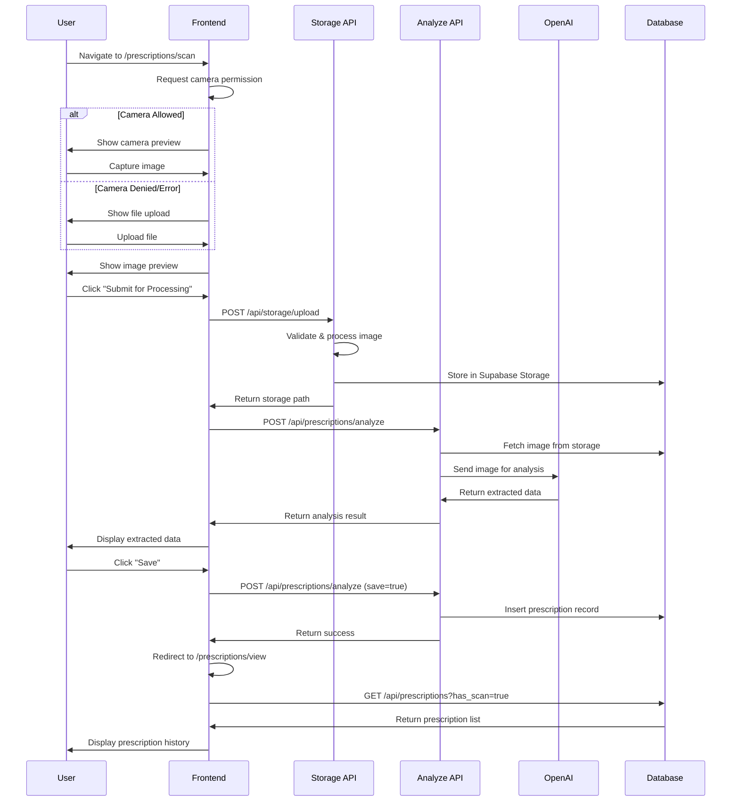

# Prescription Scanning System - Complete Documentation

## Table of Contents
1. [System Overview](#system-overview)
2. [User Journey](#user-journey)
3. [Technical Architecture](#technical-architecture)
4. [File Structure](#file-structure)
5. [Database Schema](#database-schema)
6. [API Routes](#api-routes)
7. [Data Flow Sequence](#data-flow-sequence)
8. [Component Details](#component-details)
9. [Known Issues](#known-issues)
10. [Security Considerations](#security-considerations)

---

## System Overview

The Prescription Scanning System allows users to digitize their paper prescriptions using their device camera or file upload. The system uses OpenAI Vision API to extract prescription data and stores it securely in the database.

### Key Features
- Real-time camera capture
- File upload fallback
- AI-powered text extraction
- Secure image storage
- Prescription history tracking
- No manual editing (fraud prevention)

---

## User Journey

### Starting Points
1. **Home Page** → Prescriptions tile → Prescriptions overview
2. **Sidebar** → Health → Prescriptions (expanded) → Scan Script

### Complete User Flow
```
1. User navigates to /prescriptions
   └─> Sees two tiles: "Scan Script" and "View Scripts"

2. User clicks "Scan Script"
   └─> Routes to /prescriptions/scan
   └─> Camera permission request (if first time)

3. Camera State Options:
   a. Camera Allowed → Live preview shown
      └─> User captures image
      └─> Shows preview with "Submit for Processing" button
   
   b. Camera Denied/Not Found → Error state shown
      └─> Shows file upload option
      └─> User uploads image file
      └─> Shows preview with "Submit for Processing" button

4. User clicks "Submit for Processing"
   └─> Shows "Analyzing prescription..." loading state
   └─> API processes image with OpenAI

5. Processing Results:
   a. Success → Shows extracted prescription data
      └─> User can "Save" or "Re-scan"
      └─> Save → Stores to database → Redirects to /prescriptions/view
   
   b. Not a Prescription → Shows error message
      └─> User can "Re-scan" or "Cancel"
```

---

## Technical Architecture

### Frontend Components

```
/app/(authenticated)/prescriptions/
├── page.tsx                    # Prescriptions tiles page
├── scan/
│   └── page.tsx               # Camera capture page
└── view/
    └── page.tsx               # Prescription history list

/components/
├── features/
│   ├── prescriptions/
│   │   ├── PrescriptionsTiles.tsx    # Overview tiles
│   │   ├── PrescriptionReport.tsx    # Analysis results display
│   │   └── PrescriptionDetail.tsx    # Individual prescription view
│   └── scanning/
│       ├── ScanCapture.tsx           # Main camera component
│       └── ScanHistory.tsx           # Prescription list component
└── templates/
    └── CameraCaptureTemplate.tsx     # Reusable camera template
```

### Backend Routes

```
/app/api/
├── prescriptions/
│   ├── route.ts                    # GET list, POST new
│   ├── [id]/
│   │   └── route.ts               # GET/PUT/DELETE single
│   └── analyze/
│       └── route.ts               # POST for AI analysis
├── storage/
│   └── upload/
│       └── route.ts               # POST file upload
└── files/
    └── prescriptions/
        └── [id]/
            └── route.ts           # GET prescription images
```

---

## File Structure

### Camera & Capture Components

#### `/components/features/scanning/ScanCapture.tsx`
Main component that handles:
- Camera initialization via `useCamera` hook
- Image capture via `useImageCapture` hook
- File upload via `useFileUpload` hook
- State management for capture flow
- Integration with CameraCaptureTemplate

#### `/components/templates/CameraCaptureTemplate.tsx`
Reusable template providing:
- Full-screen camera view
- Document guide overlay
- Capture controls
- Error states
- File upload fallback
- Preview display

### Hooks

#### `/hooks/useCamera.ts`
- Manages camera permissions
- Handles getUserMedia API
- Stream management
- Camera switching (front/back)
- Error handling

#### `/hooks/useImageCapture.ts`
- Canvas-based image capture
- Image compression
- File conversion
- Mirror correction for selfie camera

#### `/hooks/useFileUpload.ts`
- Standardized file upload
- Progress tracking
- Error handling
- Integration with storage API

---

## Database Schema

### Table: `patient_prescriptions`

```sql
CREATE TABLE patient_prescriptions (
  prescription_id UUID PRIMARY KEY DEFAULT gen_random_uuid(),
  user_id UUID REFERENCES auth.users(id),
  
  -- Image Storage
  image_url TEXT,                    -- Path to uploaded image
  extracted_text TEXT,               -- Raw OCR text (if any)
  
  -- Patient Information
  patient_name VARCHAR(255),
  patient_surname VARCHAR(255),
  
  -- Doctor Information  
  dr_name VARCHAR(255),
  dr_surname VARCHAR(255),
  practice_number VARCHAR(50),
  
  -- Prescription Details
  prescription_date DATE,
  condition_diagnosed TEXT,
  medications_prescribed JSONB,      -- Array of medication objects
  
  -- AI Analysis Fields
  inferred_diagnosis TEXT,
  inferred_side_effects TEXT,
  inferred_contraindications TEXT,
  scan_quality_score DECIMAL(3,2),
  
  -- Status
  status VARCHAR(50) DEFAULT 'active',
  is_active BOOLEAN DEFAULT true,
  
  -- Timestamps
  created_at TIMESTAMP WITH TIME ZONE DEFAULT NOW(),
  updated_at TIMESTAMP WITH TIME ZONE DEFAULT NOW()
);

-- Row Level Security
ALTER TABLE patient_prescriptions ENABLE ROW LEVEL SECURITY;

CREATE POLICY "Users can view own prescriptions"
  ON patient_prescriptions FOR SELECT
  USING (auth.uid() = user_id);

CREATE POLICY "Users can insert own prescriptions"
  ON patient_prescriptions FOR INSERT
  WITH CHECK (auth.uid() = user_id);
```

### Medications JSONB Structure

```json
{
  "name": "Paracetamol",
  "dosage": "500mg",
  "strength": "500mg",
  "frequency": "3 times daily",
  "timesPerDay": "3",
  "duration": "5 days",
  "instructions": "Take with food",
  "repeats": 2,
  "confidence": 95
}
```

---

## API Routes

### 1. Upload Image
`POST /api/storage/upload`

**Purpose**: Upload prescription image to Supabase storage

**Request**:
```json
{
  "file": "base64_encoded_image",
  "fileName": "prescription_1234567890.jpg",
  "fileType": "image/jpeg",
  "bucket": "prescription-images"
}
```

**Response**:
```json
{
  "data": {
    "path": "user_id/timestamp_filename.jpg",
    "url": "signed_url_for_access",
    "fileName": "prescription_1234567890.jpg",
    "fileSize": 123456,
    "fileType": "image/jpeg"
  }
}
```

### 2. Analyze Prescription
`POST /api/prescriptions/analyze`

**Purpose**: Process image with OpenAI Vision API

**Request**:
```json
{
  "uploadedPath": "user_id/timestamp_filename.jpg",
  "save": false
}
```

**Response** (Analysis Only):
```json
{
  "isPrescription": true,
  "patientName": "John",
  "patientSurname": "Doe",
  "doctorName": "Dr. Smith",
  "medications": [...],
  "uploadedPath": "user_id/timestamp_filename.jpg"
}
```

**Request** (Save):
```json
{
  "uploadedPath": "user_id/timestamp_filename.jpg",
  "save": true,
  "analysisResult": {...}
}
```

**Response** (Save):
```json
{
  "prescription": {
    "prescription_id": "uuid",
    "created_at": "2025-01-17T..."
  }
}
```

### 3. List Prescriptions
`GET /api/prescriptions?has_scan=true`

**Purpose**: Get user's prescription history

**Response**:
```json
{
  "data": [
    {
      "prescription_id": "uuid",
      "patient_name": "John",
      "dr_name": "Dr.",
      "image_url": "path/to/image.jpg",
      "created_at": "2025-01-17T..."
    }
  ]
}
```

### 4. Get Prescription Image
`GET /api/files/prescriptions/[id]`

**Purpose**: Securely serve prescription images

**Response**: Binary image data with appropriate headers

---

## Data Flow Sequence

### Complete Flow Diagram



---

## Component Details

### ScanCapture Component States

```typescript
// State flow in ScanCapture.tsx
const [capturedImage, setCapturedImage] = useState<string | null>(null)
const [isProcessing, setIsProcessing] = useState(false)
const [analysisResult, setAnalysisResult] = useState<AnalysisResult | null>(null)
const [uploadedPath, setUploadedPath] = useState<string | null>(null)

// State Transitions:
// 1. Initial → Camera/Upload
// 2. Camera/Upload → Captured (capturedImage set)
// 3. Captured → Processing (isProcessing = true)
// 4. Processing → Analyzed (analysisResult set)
// 5. Analyzed → Saved → Redirect
```

### Camera Template Props

```typescript
interface CameraCaptureTemplateProps {
  videoRef?: React.RefObject<HTMLVideoElement>
  canvasRef?: React.RefObject<HTMLCanvasElement>
  previewImage?: string | null
  isLoading?: boolean
  isProcessing?: boolean
  error?: string | null
  permissionStatus?: 'granted' | 'denied' | 'prompt' | null
  onCapture: () => void
  onCancel: () => void
  onSwitchCamera?: () => void
  onRetake?: () => void
  onFileUpload?: (file: File) => void
  onSubmitForProcessing?: () => void
  processingMessage?: string
}
```

---

## Known Issues

### 1. "Analyzing prescription..." Shows Prematurely
**Issue**: The template shows "Analyzing prescription..." message even when `isProcessing` is false

**Location**: `/components/templates/CameraCaptureTemplate.tsx`

**Root Cause**: The `processingMessage` prop is being passed with a value even when not processing

**Fix**: In ScanCapture.tsx, line ~280:
```typescript
// Current (buggy):
processingMessage={isProcessing ? 'Analyzing prescription...' : undefined}

// Should check if actually processing
processingMessage={isProcessing && analysisResult === null ? 'Analyzing prescription...' : undefined}
```

### 2. Camera Horizontal Mirror Issue
**Issue**: Camera preview is horizontally flipped (hand moves left, image moves right)

**Location**: `/components/templates/CameraCaptureTemplate.tsx`

**Root Cause**: CSS transform is applied for front camera but movement is inverted

**Current Code**:
```css
.camera-video-selfie {
  transform: scaleX(-1);  /* This mirrors the display */
}
```

**Fix Options**:
1. Remove the mirror transform entirely
2. Apply mirror only to the captured image, not the preview
3. Use different transforms for preview vs capture

**Recommendation**: Remove the transform from preview, apply it only during capture if needed.

---

## Security Considerations

### 1. No Manual Editing
- Users cannot edit extracted prescription data
- Prevents prescription fraud (adding controlled substances)
- If unhappy with results, must re-scan

### 2. Row Level Security
- Users can only see their own prescriptions
- Enforced at database level
- API routes verify ownership

### 3. Secure Image Access
- Images served through authenticated API route
- Direct storage URLs never exposed
- Each request verified for ownership

### 4. Input Validation
- File type validation (images only)
- File size limits (10MB)
- Content type verification

---

## Configuration Files

### Camera Configuration
`/lib/configs/camera-ui-config.ts`
- Camera settings
- Button positions
- Document guide specs

### Medical Analysis Configuration
`/lib/configs/medical-analysis-config.ts`
- AI prompts
- Confidence thresholds
- Field extraction rules

### OpenAI Prompt Template
```typescript
const PRESCRIPTION_PROMPT = `
Analyze this prescription image and extract:
1. Patient name and surname
2. Doctor name and practice number
3. Prescription date
4. Diagnosis/condition
5. All medications with:
   - Name
   - Dosage
   - Frequency
   - Duration
   - Instructions

Return JSON format with isPrescription: true/false
`
```

---

## Testing Checklist

### Camera Flow
- [ ] Camera permission grant
- [ ] Camera permission deny
- [ ] Camera not available
- [ ] Switch camera (front/back)
- [ ] Capture image
- [ ] Retake image

### Upload Flow
- [ ] Upload JPEG
- [ ] Upload PNG
- [ ] Upload oversized file (>10MB)
- [ ] Upload non-image file

### Analysis Flow
- [ ] Successful prescription analysis
- [ ] Non-prescription image
- [ ] Blurry/unreadable image
- [ ] Network timeout

### Save Flow
- [ ] Save successful analysis
- [ ] Handle save errors
- [ ] View saved prescription

### Navigation
- [ ] From home to scan
- [ ] From scan to list
- [ ] Back navigation
- [ ] Deep linking

---

## Troubleshooting Guide

### Camera Not Working
1. Check browser permissions
2. Ensure HTTPS connection
3. Try different browser
4. Check console for getUserMedia errors

### Upload Failing
1. Verify file size (<10MB)
2. Check file format (JPEG/PNG)
3. Confirm storage bucket exists
4. Check network connectivity

### Analysis Errors
1. Check OpenAI API key
2. Verify API quota
3. Review image quality
4. Check prompt configuration

### Save Not Working
1. Confirm user authentication
2. Check database permissions
3. Verify RLS policies
4. Review API logs